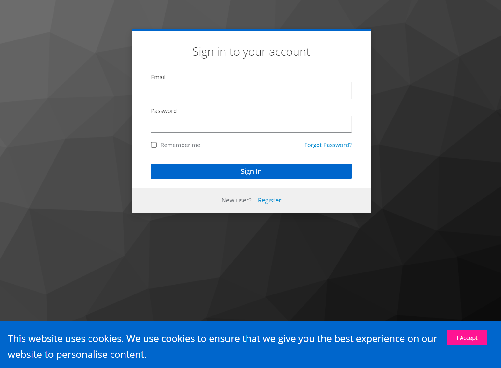

# Keycloak GDPR theme
Extension for base keycloak theme with cookies accept.



Based on Keycloak 19.0.3

## Instalation

Just clone repo to the Keycloak themes folder

```
git clone git@github.com:longdog/keycloak-gdpr-theme.git keycloak/themes
```

and select the gdpr theme in your Realm settings.
